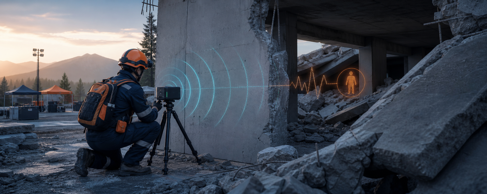
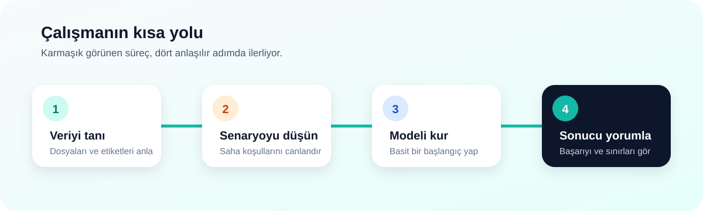

  

<h1 align="center">UWB – Afet Çalışması</h1>

  Radar verileriyle afet ortamlarında temassız insan varlığı tespitini araştıran staj projesi

  

| Proje bilgisi | Açıklama |
|---|---|
| **Hazırlayan** | Hüseyin Enes Ertürk |
| **Kurum** | İNOSENS |
| **Staj dönemi** | 29 Haziran – 27 Temmuz |
| **Çalışma konusu** | UWB radar ile afet ortamlarında insan varlığı tespiti |

## Bu staj neyi araştırıyor?

UWB radar, gönderdiği radyo sinyallerinin çevredeki nesnelerden nasıl geri döndüğünü ölçer. Staj süreci boyunca öncelikle UWB ve mmWave kavramlarına hakim olmaya çalıştım. Farklı ürün araştırmaları gerçekleştirdim. Daha sonrasında araştırmalarım sonucunda bulmuş olduğum veri seti üzerinden engel arkası insan var-yok tespiti yapabilen basit bir model geliştirdim.

Çalışmayı üç parçaya ayırdım:

- Veri setlerini tanımak
- Afet ortamlarında karşılaşılabilecek durumları görselleştirmek
- Rescuer veri setiyle basit bir başlangıç modeli geliştirmek

> [!IMPORTANT]
> Bu repo bir staj ve öğrenme çalışmasıdır. Hazırlanan model, gerçek arama-kurtarma kararlarında tek başına kullanılabilecek bir saha sistemi değildir.

## 4 Haftalık Staj Özeti

| Hafta | Staj günleri | Haftanın konusu | Ortaya çıkan çalışma |
|---|---:|---|---|
| [**1. Hafta**](docs/staj-gunlugu/hafta-1.md) | 1–5 | UWB teknolojisini araştırma ve bilgileri derleme | UWB araştırma notları ve ilk hafta raporu |
| [**2. Hafta**](docs/staj-gunlugu/hafta-2.md) | 6–10 | UWB ve mmWave veri setlerini inceleme | Veri seti, makale ve kullanım amacı notları |
| [**3. Hafta**](docs/staj-gunlugu/hafta-3.md) | 11–15 | Veri sözlüğü, dokümantasyon ve model araştırması | Düzenlenmiş veri seti sayfaları ve model planı |
| [**4. Hafta**](docs/staj-gunlugu/hafta-4.md) | 16–20 | Rescuer verisiyle örnek model ve GitHub reposu | Model denemeleri, sonuçlar ve tamamlanan repo |

[Staj günlüğü →](docs/staj-gunlugu/README.md)

## İçerik

| Bölüm | İçerik |
|---|---|
| [**Başlangıç rehberi**](docs/baslangic/README.md) | UWB radarın temel fikri ve önerilen okuma sırası |
| [**Staj günlüğü**](docs/staj-gunlugu/README.md) | Dört haftanın gün gün çalışma özeti |
| [**Veri setleri**](docs/veri-setleri/README.md) | Rescuer, MobiVital ve OMuSense-23 veri setlerinin tanıtımı |
| [**Teknoloji ve ürünler**](docs/teknoloji-ve-urunler/README.md) | İlk hafta raporundan UWB–mmWave karşılaştırması, küresel ürünler ve saha yaklaşımı |
| [**Afet senaryoları**](docs/senaryolar/README.md) | Doğrudan görüş, duvar arkası, enkaz ve boş ortam örnekleri |
| [**Rescuer model günlüğü**](docs/model/README.md) | Veriyi hazırlamadan sonuçları yorumlamaya kadar model süreci |
| [**Projeyi çalıştırma**](docs/kullanim/README.md) | Kurulum, veri yolu ve gerekli komutlar |
| [**Güvenli kullanım**](docs/guvenli-kullanim/README.md) | Çalışmanın sınırları, etik notlar ve kaynakça |

## Veri setlerinin projedeki yeri

| Veri seti | Bu repoda nasıl kullanıldı? |
|---|---|
| [**Rescuer**](docs/veri-setleri/rescuer.md) | İncelendi, görselleştirildi ve insan var/yok modeli geliştirildi |
| [**MobiVital**](docs/veri-setleri/mobivital.md) | Veri yapısı ve ilgili yayın tanıtıldı |
| [**OMuSense-23**](docs/veri-setleri/omusense-23.md) | Veri yapısı, sensörleri ve ilgili yayın tanıtıldı |

Modeli yalnızca **Rescuer** verisiyle kurdum. MobiVital ve OMuSense-23'ü ise sadece tanıttım.

## Elde ettiğim ilk sonuç

Rescuer verisiyle kurduğum Logistic Regression modelinde test sonucu **%90,4 dengeli doğruluk** ve **%87,7 insan yakalama oranı** çıktı. Bu değerler kontrollü deneylere ait; gerçek enkaz başarısı olarak düşünülmemelidir.

[Model sonuçları →](docs/model/sonuclar.md)

---

  İNOSENS staj sonu teslimi · Hüseyin Enes Ertürk

