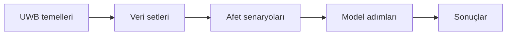

[← Ana sayfa](../../README.md)

# Başlangıç Rehberi

Bu bölüm, UWB radar ve makine öğrenmesinin projede kullanılan temel kavramlarını teknik ayrıntıya girmeden tanıtır.

## Önerilen başlangıç

| Sayfa | İçerik |
|---|---|
| [**UWB radar temelleri**](uwb-radar-temelleri.md) | Radarın yansımayı nasıl ölçtüğü; menzil, kare, genlik ve faz kavramları |

## Dört temel kavram

| Kavram | En sade anlamı |
|---|---|
| UWB radar | Kısa radyo sinyalleri gönderip yansımaları dinleyen sensör |
| Menzil noktası | Belirli bir uzaklığı temsil eden ölçüm bölgesi |
| Genlik | Geri dönen sinyalin gücü |
| Faz | Sinyal dalgasının çevrim içindeki konumu |

## Projenin temel sorusu

> Bir radar kaydındaki küçük değişimler, ortamda insan bulunup bulunmadığını göstermeye yardımcı olabilir mi?

Bu soruya cevap ararken önce veriyi tanıdım, ardından basit bir model kurup hata yaptığı durumlara baktım.

---

[Sonraki: UWB radar temelleri →](uwb-radar-temelleri.md)
