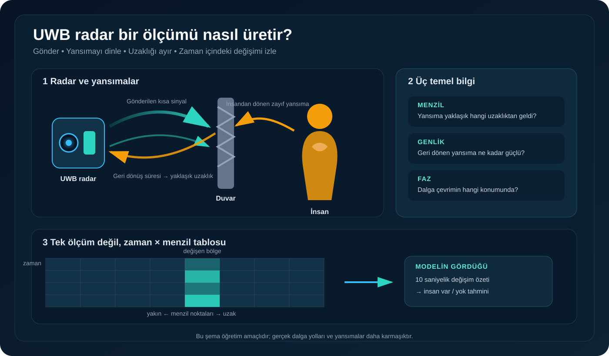
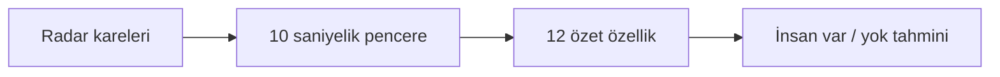

[← Başlangıç rehberi](README.md)

# UWB Radar Temelleri

## Radarın yaptığı iş

UWB radar, çok kısa radyo sinyalleri gönderir ve çevredeki yüzeylerden geri dönen yansımaları ölçer. Temel fikir, karanlık bir odada yankıyı dinlemeye benzer; ancak burada ses yerine radyo dalgası kullanılır.

Süreç dört basit adımdan oluşur:

1. Radar kısa bir sinyal gönderir.
2. Sinyal; duvar, eşya ve insan gibi yüzeylerden yansır.
3. Dönüş süresi, yansımanın yaklaşık hangi uzaklıktan geldiğini gösterir.
4. Ölçüm tekrarlandıkça aynı uzaklıktaki küçük değişimler izlenir.

## İnsan nasıl fark edilebilir?

Hareketsiz yatan bir insan tamamen sabit değildir. Solunum, göğüs bölgesinde küçük ve düzenli hareketler oluşturabilir. Radar aynı menzil bölgesini art arda ölçtüğünde bu değişimleri görebilir.

Fakat her değişim insan anlamına gelmez:

- Ortam titreşimi
- Sensörün hareket etmesi
- Ekip veya araç hareketi
- Fan ve perde gibi hareketli nesneler
- Güçlü duvar yansımaları

benzer değişimler üretebilir. Bu nedenle tek bir sinyal tepesine bakarak karar verilmez.

## CSV dosyasının yapısı

Bir radar CSV’si, zaman ve uzaklıktan oluşan bir ölçüm tablosudur:

| Yön | Ne anlatır? |
|---|---|
| Satırlar | Art arda alınan radar kareleri; yani zaman |
| Sütunlar | Yakından uzağa menzil noktaları |
| Hücre | Belirli zamanda ve uzaklıkta ölçülen radar değeri |

Rescuer genlik dosyalarında:

- Her karede **109 menzil noktası** bulunur.
- Komşu noktalar arasında yaklaşık **5,1 cm** vardır.
- Radar saniyede yaklaşık **17 kare** üretir.
- İlk satır ölçüm değil, uzaklık eksenidir.

## Kare ve pencere arasındaki fark

- **Kare:** Radarın tek bir andaki menzil ölçümüdür.
- **Pencere:** Art arda gelen karelerin birlikte incelendiği zaman bölümüdür.

Bu projedeki ilk model **170 kareyi**, yani yaklaşık **10 saniyeyi** tek örnek olarak kullanır. Model böylece tek bir ana değil, kısa süre içindeki değişime bakar.

## Genlik ve faz

| Gösterim | Sade anlamı | Bu projedeki durum |
|---|---|---|
| Genlik (`abs`) | Yansımanın ne kadar güçlü döndüğü | İlk modellerde kullanılıyor |
| Faz (`angle`) | Dalganın çevrim içindeki konumu | Ölçeği doğrulandıktan sonra incelenecek |

Faz, çok küçük yer değiştirmelere duyarlı olabilir. Ancak değer çevrim sonunda başa dönebildiği ve dosya gruplarında ölçek farkları görülebildiği için dikkatli hazırlanmalıdır.

## Model radarı doğrudan mı görüyor?

İlk model ham CSV’nin tamamını doğrudan kullanmaz. Her 10 saniyelik pencereden 12 küçük özet çıkarır:

- Zaman içindeki değişkenlik
- Ardışık kareler arasındaki değişim
- Hareket enerjisi
- Değişimin menzile ne kadar yayıldığı

Böylece model binlerce ham sayı yerine 12 özet değeri kullanır.

## Radar kamera değildir

Bu veri setindeki radar çıktısı klasik bir fotoğraf değildir; yüz veya renkli görüntü üretmez. Yine de varlık ve hareket bilgisi verdiği için ölçüm izni ve veri güvenliği göz ardı edilmemelidir.

## Bu projedeki sınır

> [!CAUTION]
> Kontrollü odada insan varlığını ayırabilmek, gerçek enkaz altında güvenilir insan tespiti yapıldığı anlamına gelmez.

Başlangıç modelini yalnızca Rescuer 2023 genlik kayıtlarında denedim. Gerçek enkazı, farklı radarları ve hareketli saha ekiplerini test etmedim.

## Kaynaklar

- [Rescuer 2023 resmî Zenodo kaydı](https://doi.org/10.5281/zenodo.7679165)
- [FCC — Ultra-Wideband Transmission Systems](https://docs.fcc.gov/public/attachments/FCC-00-163A1.pdf)
- [Proje kaynakçası](../guvenli-kullanim/kaynakca.md)

---

[← Başlangıç rehberi](README.md)
