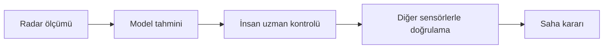

[← Başlangıç rehberi](../baslangic/README.md) · [Ana sayfa](../../README.md)

# Sınırlamalar ve Güvenli Kullanım

Burada modelin nerede kullanılmaması gerektiğini ve veriyle çalışırken dikkat ettiğim noktaları topladım.

> [!CAUTION]
> Bu repo bir staj, araştırma ve öğrenme çalışmasıdır. Gerçek arama-kurtarma kararlarını tek başına verebilecek doğrulanmış bir sistem değildir.

## Bu kategoride ne var?

| Sayfa | İçerik |
|---|---|
| [**Güvenli kullanım ve sınırlamalar**](sinirlamalar.md) | Modelin kullanım amacı, hata riskleri, veri gizliliği ve saha öncesi gereksinimler |
| [**Kaynakça**](kaynakca.md) | Veri setleri, radar çalışmaları ve kullandığım diğer kaynaklar |

## Sonuç nasıl kullanılmalı?

Model yalnızca bir tahmin verir. Gerçek bir kararda bu tahmin uzman kontrolü ve başka sensörlerle desteklenmelidir.

## Hızlı özet

- Modeli yalnızca kontrollü Rescuer kayıtlarıyla denedim.
- Gerçek enkazı, hareketli ekipleri ve farklı radar cihazlarını test etmedim.
- Hem insan kaçırma hem yanlış alarm riski vardır.
- Ham veri ve eğitilmiş modeller GitHub’a yüklenmez.
- Veri setinin lisans ve atıf koşulları korunur.

---

[Güvenli kullanım ayrıntıları →](sinirlamalar.md)
