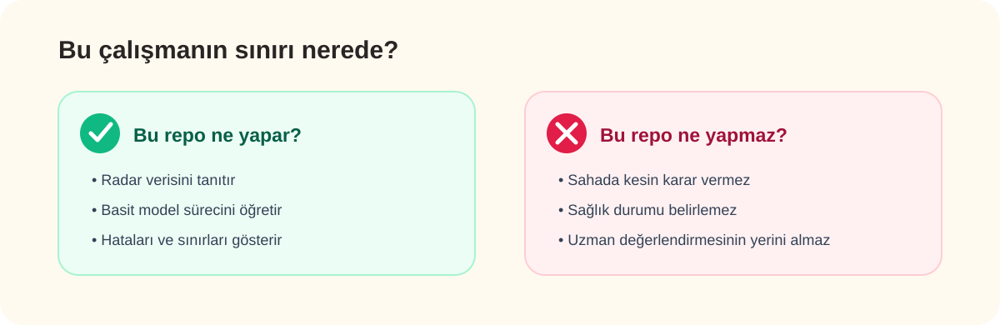

[← Güvenli kullanım](README.md) · [Kaynakça](kaynakca.md)

# Güvenli Kullanım ve Sınırlamalar

Bu proje radar verisini ve temel makine öğrenmesi adımlarını öğrenmek için hazırlanmıştır. Bir saha ürünü veya kesin karar sistemi değildir.

## Modelin gördüğü veriler

| Başlık | Bu çalışmadaki durum |
|---|---|
| Veri seti | Rescuer 2023 |
| Katılımcı | 9 kişi |
| Görev | 10 saniyelik kayıtta insan var / yok |
| Kullanılan veri | UWB radar genliği |
| Gerçek enkaz | Yok |

Model farklı radarları, farklı binaları ve gerçek afet sahalarını görmemiştir. Bu nedenle elde edilen sonuçlar yalnızca incelenen deney koşullarını anlatır.

## Karşılaşılabilecek üç hata

### İnsan kaçırma

Model bazı insan bulunan kayıtları “insan yok” olarak değerlendirebilir. Bu yüzden negatif tahmin, bölgede kesinlikle kimse olmadığı anlamına gelmez.

### Yanlış alarm

Ortamdaki hareket veya yansıma değişimi insan varmış gibi yorumlanabilir. Fazla yanlış alarm ekiplerin zaman kaybetmesine neden olabilir.

### Ortam değişimi

Duvar malzemesi, mesafe, titreşim ve radar konumu değiştiğinde modelin davranışı da değişebilir.

## Akılda tutulması gerekenler

1. Son kararı model vermemeli.
2. Sonuç başka bir sensör veya arama yöntemiyle kontrol edilmeli.
3. Model farklı bir ortamda kullanılmadan önce yeniden denenmeli.
4. Ölçüm izni ve kişisel verilerin gizliliği korunmalı.

> [!CAUTION]
> “İnsan var” sonucu bir işarettir, kesin kanıt değildir. “İnsan yok” sonucu da alanın güvenli veya boş olduğunu garanti etmez.

## Veri ve lisans notu

Rescuer veri seti **CC BY-NC-SA 4.0** lisansıyla yayımlanmıştır. Kaynak gösterilmeli, ticari kullanım koşulları ayrıca kontrol edilmeli ve ham veriler izinsiz yeniden dağıtılmamalıdır.

Repo için ayrı bir kaynak kod lisansı eklemedim. Kodu repo dışında kullanmak için önce İNOSENS'e danışmak gerekir.

---

[← Kategori](README.md) · [Kaynakça →](kaynakca.md)
