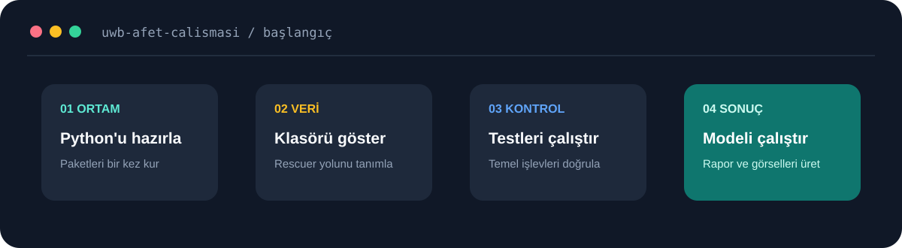

[← Ana sayfa](../../README.md) · [Model günlüğü](../model/README.md)

# Projeyi Çalıştırma

Bu rehber, Rescuer analizlerinin Windows ve PowerShell üzerinde yeniden çalıştırılması için gereken adımları içerir.



## Gerekenler

- Python 3.10 veya üzeri
- Git
- Bu özel GitHub reposuna erişim
- Rescuer veri setinin yerel kopyası

> [!IMPORTANT]
> Ham radar verileri büyük olduğu için repoda bulunmaz. Veri setinin ayrıca edinilmesi ve yerel bilgisayarda tutulması gerekir.

## 1. Repo indirme

```powershell
git clone https://github.com/huseyineneserturk/UWB-Afet-Calismasi.git
cd UWB-Afet-Calismasi
```

## 2. Python ortamı

```powershell
python -m venv .venv
.\.venv\Scripts\Activate.ps1
python -m pip install -r requirements.txt
```

`python` komutu bulunamazsa aynı komutlarda `py` kullanılabilir.

## 3. Veri yolu

Rescuer klasöründe `Human Presence` ve `No human Presence` alt klasörleri bulunmalıdır.

```powershell
$dataRoot = "C:\Veriler\Rescuer-Veri-Seti"
```

Örnek yol, veri setinin bulunduğu gerçek klasör yoluyla değiştirilmelidir.

## 4. Test ve model

Önce proje testleri çalıştırılır:

```powershell
python -m unittest discover -s tests -v
```

Ardından başlangıç modeli üretilir:

```powershell
python scripts\train_rescuer_baseline.py --data-root $dataRoot
```

Bu iki komut, projenin temel akışını denemek için yeterlidir.

## İsteğe bağlı analizler

| Amaç | Komut |
|---|---|
| Örnek radar sinyalini çizmek | `python scripts\plot_rescuer_examples.py --data-root $dataRoot` |
| İki modeli karşılaştırmak | `python scripts\compare_rescuer_models.py --data-root $dataRoot` |
| Hataları koşullara göre incelemek | `python scripts\analyze_rescuer_errors.py --data-root $dataRoot` |
| Karar eşiğini değerlendirmek | `python scripts\tune_rescuer_threshold.py --data-root $dataRoot` |

Analiz sırasında `[25/373] dosya işlendi` benzeri mesajlar görülmesi normaldir.

## Çıktılar

| Klasör | İçerik |
|---|---|
| `reports/` | Sonuçları içeren küçük JSON ve CSV dosyaları |
| `assets/images/` | Dokümanlarda kullanılan grafikler |
| `models/` | Yerel olarak kaydedilen model dosyaları |

Ham veri ve `models/` klasörü GitHub'a gönderilmez.

## Sık karşılaşılan iki sorun

**“Genlik CSV dosyası bulunamadı”**

Bu hatada `$dataRoot` değişkeninin iki Rescuer alt klasörünü içeren ana klasörü gösterip göstermediği kontrol edilmelidir.

**“ModuleNotFoundError”**

Sanal ortam yeniden etkinleştirilip paketler tekrar kurulabilir:

```powershell
.\.venv\Scripts\Activate.ps1
python -m pip install -r requirements.txt
```

---

[Model geliştirme günlüğü](../model/README.md) · [Güvenli kullanım](../guvenli-kullanim/sinirlamalar.md)
