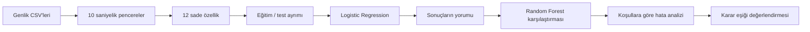

[← Başlangıç rehberi](../baslangic/README.md) · [Ana sayfa](../../README.md)

# Model Geliştirme Günlüğü

Rescuer verisiyle kurduğum ilk modelin adımlarını burada sırasıyla anlattım.

## Yol haritası

| Adım | Konu | Sayfa |
|---|---|---|
| 1 | Radar kayıtlarının küçük model örneklerine dönüştürülmesi | [Veriyi hazırlama](veri-hazirlama.md) |
| 2 | Logistic Regression seçimi ve kullanımı | [İlk model](ilk-model.md) |
| 3 | Doğru ve yanlış model kararları | [Sonuçlar ve sınırlar](sonuclar.md) |
| 4 | Logistic Regression ve Random Forest karşılaştırması | [Model karşılaştırması](model-karsilastirmasi.md) |
| 5 | Modelin zorlandığı koşullar | [Hata analizi](hata-analizi.md) |
| 6 | İnsan kaçırma ve yanlış alarm arasındaki denge | [Doğrulama ve karar eşiği](karar-esigi.md) |

## İlk görev

Model her 10 saniyelik radar penceresi için şu iki yanıttan birini üretir:

- `0` — İnsan yok
- `1` — İnsan var

Bu bir **başlangıç modeli**dir. Gerçek enkaz altında kullanılabilecek doğrulanmış bir güvenlik sistemi değildir.

## Neden bu sırayla ilerledim?

Önce basit bir Logistic Regression modeli kurdum. Ardından aynı veride Random Forest modelini de deneyip sonuçları karşılaştırdım.

> [!NOTE]
> Bu çalışmada yalnızca genlik dosyalarını kullandım. Faz verisini ilk modelin kapsamına almadım.

## Modeli yeniden çalıştırma

Kurulum ve analiz komutları [**Projeyi Çalıştırma Rehberi**](../kullanim/README.md) içinde yer alır.

---

[Sonraki: Veriyi hazırlama →](veri-hazirlama.md)
