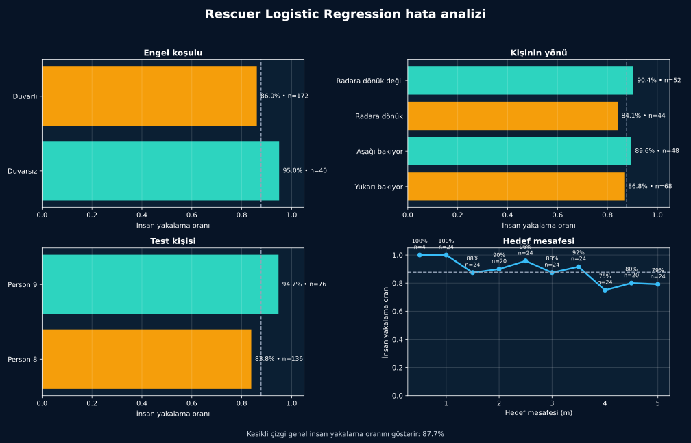

[← Model karşılaştırması](model-karsilastirmasi.md) · [Model günlüğü](README.md)

# 5. Hata Analizi

Bu sayfada yeni bir model kurmadım. Başlangıç modelinin hangi koşullarda zorlandığına baktım.

## Grafik nasıl okunur?

Yüksek çubuk, o gruptaki insan kayıtlarının daha büyük bölümünün bulunduğunu gösterir. Kesikli çizgi modelin genel insan yakalama oranıdır: **%87,7**.

## En belirgin bulgu: mesafe

| Mesafe | Bulunan / toplam | İnsan yakalama |
|---|---:|---:|
| 0,5–3,5 m | 133 / 144 | **%92,4** |
| 4–5 m | 53 / 68 | **%77,9** |

Uzak mesafedeki daha zayıf radar değişimleri model için daha zor görünmektedir. Ancak test yalnızca iki kişiden geldiği için bu sonuç genel bir radar menzil sınırı değildir.

## Duvar etkisi

| Koşul | Bulunan / toplam | İnsan yakalama |
|---|---:|---:|
| Duvarsız | 38 / 40 | **%95,0** |
| Duvarlı | 148 / 172 | **%86,0** |

Duvarlı grupta başarı daha düşüktür. Fakat kişi, mesafe ve radar yerleşimi koşulları da değiştiği için farkın yalnızca duvardan kaynaklandığı söylenemez.

## Sonuç

Modelin en belirgin zayıflığını 4–5 metre grubunda gördüm. Duvarlı ölçümler de daha zor görünüyor; ancak bunu doğrulamak için daha dengeli bir deney gerekir.

> [!NOTE]
> Hata analizi yalnızca “kaç hata var?” sorusuna değil, “hata hangi koşulda artıyor?” sorusuna cevap verir.

## Sınırlar

- Analiz yalnızca Person 8 ve Person 9 kayıtlarını kapsar.
- Aynı dosyadan gelen pencereler bağımsız saha deneyleri değildir.
- Gerçek enkaz koşulları veri setinde bulunmaz.

Sonuç dosyaları:

- [`condition_summary.csv`](../../reports/rescuer-error-analysis/condition_summary.csv)
- [`human_file_errors.csv`](../../reports/rescuer-error-analysis/human_file_errors.csv)

---

[← Model karşılaştırması](model-karsilastirmasi.md) · [Sonraki: Karar eşiği →](karar-esigi.md)
