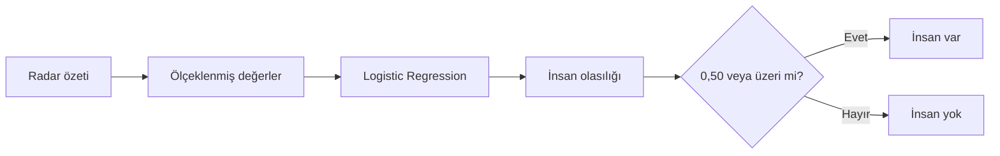

[← Veriyi hazırlama](veri-hazirlama.md) · [Model günlüğü](README.md)

# 2. İlk Model: Logistic Regression

## Model ne yapıyor?

Logistic Regression, radar bölümünden çıkarılan özetleri bir araya getirerek **insan bulunma olasılığı** üretir. Olasılık 0,50 veya üzerindeyse “insan var” kararı verilir.

## Neden bu modelle başladım?

- Hızlı eğitilir.
- Az sayıda özet değerle çalışabilir.
- Sonuçlarını açıklamak görece kolaydır.
- Daha karmaşık modelleri karşılaştırmak için iyi bir başlangıçtır.

## Eğitim akışı



Ölçekleme, özet değerlerin çok farklı büyüklüklerde olmasını engeller.

## Modeli çalıştırmak

```powershell
python scripts/train_rescuer_baseline.py `
  --data-root "<Rescuer Veri Seti klasörü>"
```

Komut dosyası önce verileri bulur, 10 saniyelik bölümleri hazırlar, modeli eğitir ve sonuçları kaydeder.

## Üretilen dosyalar

| Çıktı | Amaç |
|---|---|
| `reports/rescuer-baseline/metrics.json` | Sonuçların sayısal özeti |
| `reports/rescuer-baseline/split_summary.csv` | Eğitim ve test sayıları |
| `assets/images/model/*.svg` | Dokümanlarda kullanılan grafikler |
| `models/*.joblib` | Bilgisayarda saklanan eğitilmiş model |

Eğitilmiş model dosyasını GitHub'a eklemedim. Kod ve küçük raporlarla aynı deneyi daha sonra tekrar çalıştırabilirim.

---

[← Veriyi hazırlama](veri-hazirlama.md) · [Sonraki: Sonuçlar →](sonuclar.md)
