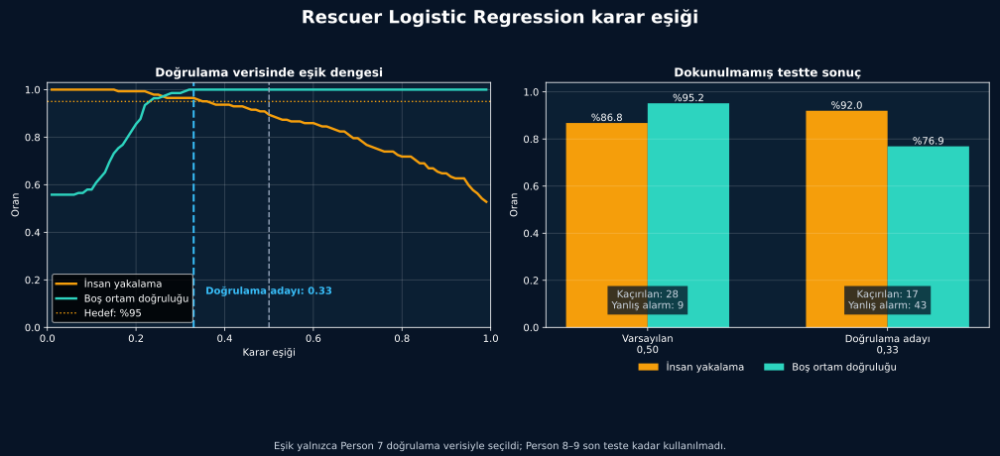

[← Hata analizi](hata-analizi.md) · [Model günlüğü](README.md)

# 6. Karar Eşiği

Model her kayıt için bir “insan olasılığı” üretir. **Karar eşiği**, bu değerin hangi noktadan sonra “insan var” sayılacağını belirler.

- Eşik düşerse daha fazla insan yakalanabilir, ancak yanlış alarm artabilir.
- Eşik yükselirse yanlış alarm azalabilir, ancak insan kaçırma riski artabilir.

## Eşiği neden test verisiyle seçmedim?

Veri üç parçaya ayrıldı:

| Bölüm | Görevi |
|---|---|
| Eğitim | Modelin örüntüyü öğrenmesi |
| Doğrulama | Eşik adayının seçilmesi |
| Test | Sonucun yalnızca bir kez kontrol edilmesi |

Aynı dosyanın parçalarını farklı bölümlere dağıtmadım. Böylece model bir kaydın devamını daha önce görmedi.

## 0,50 ve 0,33 karşılaştırması

Doğrulama verisi 0,33 eşiğini önerdi. Bu eşik testte **11 ek insan penceresini** buldu; fakat **34 ek yanlış alarm** üretti.

| Test sonucu | Eşik 0,50 | Eşik 0,33 |
|---|---:|---:|
| İnsan yakalama | %86,8 | **%92,0** |
| Yanlış alarm | **9** | 43 |
| Dengeli doğruluk | **%91,0** | %84,4 |

## Karar

> [!CAUTION]
> **0,33 yeni varsayılan eşik olarak kabul edilmedi.**

İnsan yakalama oranı yükselse de yanlış alarm sayısı çok arttı. Bu nedenle başlangıç modelinde **0,50** eşiğini korudum.

## Bu adımdan öğrendiğim

1. Model olasılığı ile son karar aynı şey değildir.
2. Bir hata türünü azaltırken diğeri artabilir.
3. Eşik seçimi için ayrı doğrulama verisi gerekir.
4. Test verisi sürekli ayar yapmak için kullanılmamalıdır.

Resmî kaynak: [scikit-learn — karar eşiğini ayarlama](https://scikit-learn.org/stable/modules/classification_threshold.html)

Sonuç dosyaları:

- [`metrics.json`](../../reports/rescuer-threshold-analysis/metrics.json)
- [`threshold_candidates.csv`](../../reports/rescuer-threshold-analysis/threshold_candidates.csv)

---

[← Hata analizi](hata-analizi.md) · [Projeyi çalıştırma rehberi →](../kullanim/README.md)
