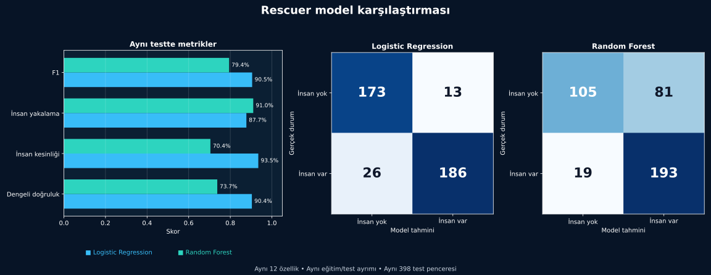

[← Sonuçlar](sonuclar.md) · [Model günlüğü](README.md)

# 4. Model Karşılaştırması

Logistic Regression ve Random Forest modellerini aynı eğitim ve test bölümlerinde karşılaştırdım. Böylece veri değişmeden iki model arasındaki farkı görebildim.

## Sonuç tablosu

| Ölçüm | Logistic Regression | Random Forest |
|---|---:|---:|
| Dengeli doğruluk | **%90,4** | %73,7 |
| İnsan kesinliği | **%93,5** | %70,4 |
| İnsan yakalama | %87,7 | **%91,0** |
| Yanlış alarm | **13** | 81 |

## Grafiğin gösterdiği sonuç

Random Forest yedi ek insan penceresini buldu; buna karşılık 68 ek yanlış alarm üretti. Logistic Regression ise iki hata türü arasında daha dengeli kaldı.

Bu nedenle başlangıç modeli olarak **Logistic Regression** modelini seçtim.

> [!IMPORTANT]
> Daha karmaşık bir model her zaman daha iyi değildir. Seçim, yalnızca yüksek skora değil hangi hatanın daha sık yapıldığına da bağlıdır.

## Bu karşılaştırmadan öğrendiğim

- Modeller aynı veride farklı hata türleri üretebilir.
- İnsan yakalama oranı tek başına yeterli değildir.
- Basit bir modelin sonucunu açıklamak ve kontrol etmek daha kolay olabilir.

Bu karşılaştırma yalnızca Rescuer verisi, seçilen özet özellikler ve mevcut test bölümü için geçerlidir.

Sonuç dosyaları:

- [`metrics.json`](../../reports/rescuer-model-comparison/metrics.json)
- [`comparison_summary.csv`](../../reports/rescuer-model-comparison/comparison_summary.csv)

---

[← Sonuçlar](sonuclar.md) · [Sonraki: Hata analizi →](hata-analizi.md)
