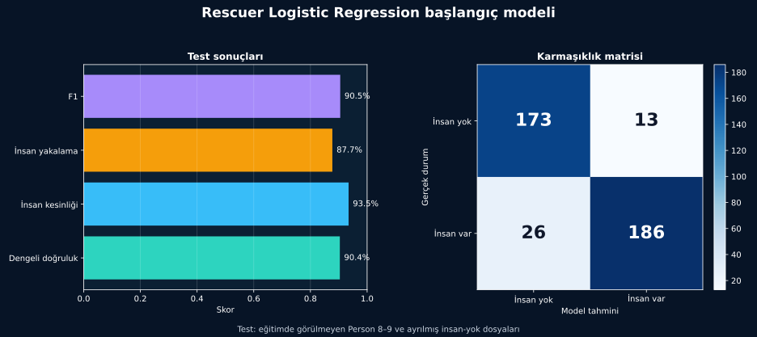

[← İlk model](ilk-model.md) · [Model günlüğü](README.md)

# 3. Sonuçlar

## Sonuç nasıl okunmalı?

Modeli, eğitim sırasında görmediği Person 8–9 kayıtları ve ayrılmış insan-yok dosyaları üzerinde denedim.

| Ölçüm | Sonuç | Sade anlamı |
|---|---:|---|
| Dengeli doğruluk | **%90,4** | İki sınıftaki başarıyı birlikte özetler |
| İnsan kesinliği | **%93,5** | “İnsan var” kararlarının ne kadarı doğru? |
| İnsan yakalama | **%87,7** | Gerçek insan kayıtlarının ne kadarı bulundu? |
| F1 skoru | **%90,5** | Kesinlik ve yakalamanın ortak özeti |

## Model nerede hata yaptı?

| Gerçek durum | Doğru karar | Yanlış karar |
|---|---:|---:|
| İnsan yok — 186 pencere | 173 | **13 yanlış alarm** |
| İnsan var — 212 pencere | 186 | **26 kaçırılan pencere** |

Afet çalışmalarında insanı kaçırmak kritik olabilir. Çok sayıda yanlış alarm da arama ekibinin zamanını etkiler. Bu yüzden iki hataya birlikte baktım.

## Bu sonuç neyi gösteriyor?

İlk denemede model, kontrollü Rescuer kayıtlarında insan varlığına ait bazı değişimleri öğrenebildi. Bu sonuç başlangıç için yeterli görünse de gerçek enkaz performansını göstermez.

Model özellikle radar kareleri arasındaki değişimden ve hareketin menzil boyunca nasıl yayıldığından yararlanır. Bunu tek başına bir fizik kuralı gibi görmek doğru olmaz.

## Sınırlar

- Sonuçlar 10 saniyelik pencere düzeyindedir.
- İnsan-yok verisi yalnızca 12 kaynak dosyadan gelir.
- Rescuer kontrollü duvarlı ve duvarsız ölçümler içerir; gerçek enkaz içermez.
- Başka bir radar veya ortamda aynı başarı garanti edilemez.

> [!CAUTION]
> Bu model bir öğrenme çıktısıdır ve gerçek arama-kurtarma kararlarında tek başına kullanılmamalıdır.

[Model karşılaştırması →](model-karsilastirmasi.md)

Sonuç dosyası: [`metrics.json`](../../reports/rescuer-baseline/metrics.json)

---

[← İlk model](ilk-model.md) · [Güvenli kullanım →](../guvenli-kullanim/sinirlamalar.md)
