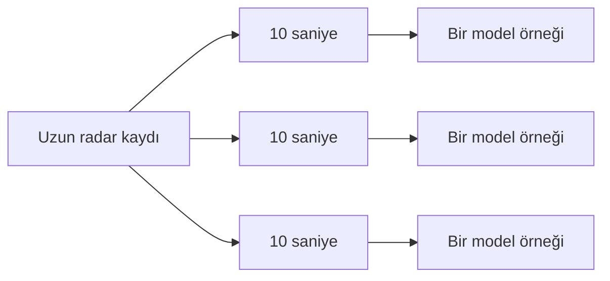

[← Model günlüğü](README.md) · [Rescuer veri sözlüğü](../veri-setleri/rescuer.md)

# 1. Veriyi Modele Hazırlama

Uzun radar kayıtlarını doğrudan modele vermedim. Önce daha küçük ve karşılaştırılabilir parçalara ayırdım.

## Kullanılan veri

- Kaynak: [Rescuer — Zenodo](https://doi.org/10.5281/zenodo.7679165)
- Kullanılan gösterim: genlik (`abs`)
- Genlik dosyası: 373
- Yaklaşık örnekleme hızı: saniyede 17 kare

İlk deneyi sade tutmak için faz dosyalarını kullanmadım.

## Pencere nedir?

Her radar kaydı yaklaşık **10 saniyelik** bölümlere ayrıldı. Model, tek bir ana değil kısa süre içindeki değişime bakar.

Uzun dosyaların modeli tek başına yönlendirmemesi için her dosyadan alınabilecek pencere sayısına sınır koydum.

## Modelin gördüğü özet

Her 10 saniyelik bölüm, on iki küçük özet değere dönüştürüldü. Bu özetler şu sorulara cevap verir:

- Sinyal zaman içinde ne kadar değişiyor?
- Ardışık radar kareleri birbirinden ne kadar farklı?
- Hareket tek bir uzaklıkta mı, geniş bir alanda mı?
- Genel hareket gücü ne kadar?

> [!TIP]
> Özellik çıkarımı, büyük bir radar tablosunu kısa bir “özet kartına” dönüştürmek gibidir.

## Eğitim ve test ayrımı

Modeli aynı kişinin benzer kayıtlarıyla sınamak yanıltıcı olabilir. Bu nedenle Person 8 ve Person 9 yalnızca test bölümünde kullanıldı. Hiçbir dosyanın parçaları hem eğitimde hem testte yer almadı.

| Bölüm | İnsan-yok penceresi | İnsan-var penceresi |
|---|---:|---:|
| Eğitim | 673 | 1.226 |
| Test | 186 | 212 |

Bu ayrım, model için daha gerçekçi bir test sağlar.

## Veri kalite notu

Bir dosya 10 saniyelik bölüm üretmeye yetmeyecek kadar kısaydı. Bu dosyayı atlayıp diğer kayıtlarla devam ettim.

---

[← Model günlüğü](README.md) · [Sonraki: İlk model →](ilk-model.md)
