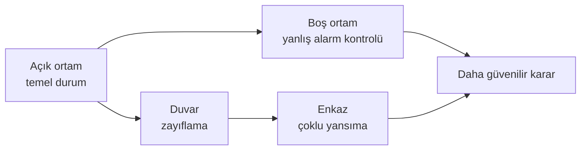

[← Başlangıç rehberi](../baslangic/README.md) · [Ana sayfa](../../README.md)

# Afet Tespit Senaryoları

Bu sayfalarda insan tespitini dört farklı ortam üzerinden anlattım. Her senaryoda şu soruya başka bir açıdan baktım:

> Radar bir değişim gördüğünde bunun gerçekten insandan geldiğini nasıl anlayacağız?

## Senaryo haritası

| Senaryo | Ana soru | Veriyle ilişkisi |
|---|---|---|
| [**1. Doğrudan görüş**](dogrudan-gorus.md) | Engel yokken insan sinyali nasıl görünür? | Rescuer açık alan kayıtları |
| [**2. Duvar arkasındaki kişi**](duvar-arkasi.md) | Duvar sinyali ve model kararını nasıl etkiler? | Rescuer duvarlı kayıtları |
| [**3. Enkaz ve karmaşık yansımalar**](enkaz-karmasik-yansima.md) | Beton, metal ve hava boşlukları sinyali nasıl karmaşıklaştırır? | Kavramsal senaryo |
| [**4. Boş ortam ve yanlış alarm**](bos-ortam-yanlis-alarm.md) | İnsan yokken model neden “insan var” diyebilir? | Rescuer boş ortam kayıtları |

## Birlikte nasıl okunmalı?

- **Doğrudan görüş**, en sade insan örneğidir.
- **Duvar arkası**, aynı görevin daha zor bir halidir.
- **Enkaz**, Rescuer verisinde bulunmayan saha karmaşıklığını gösterir.
- **Boş ortam**, yanlış alarmı anlamaya yardımcı olur.

## Önemli sınır

> [!CAUTION]
> Rescuer veri seti kontrollü duvarlı ve duvarsız deneyler içerir. Gerçek enkaz; farklı malzemeler, titreşimler, hava boşlukları ve saha hareketleri nedeniyle daha karmaşıktır. Bu nedenle bu repo henüz “enkaz altında doğrulanmış sistem” iddiasında bulunmaz.

Küçük göğüs hareketleri radar için önemli olabilir. Ancak ortam titreşimi ve sensörün yerleştirildiği nokta sonucu etkileyebilir. Bu konuda yararlandığım kaynaklar: [INACHUS proje özeti](https://cordis.europa.eu/project/id/607522/reporting) ve [radar teknolojileri incelemesi](https://doi.org/10.1109/CAMA57522.2023.10352910).

---

[← Ana sayfa](../../README.md) · [Güvenli kullanım sınırları →](../guvenli-kullanim/sinirlamalar.md)
