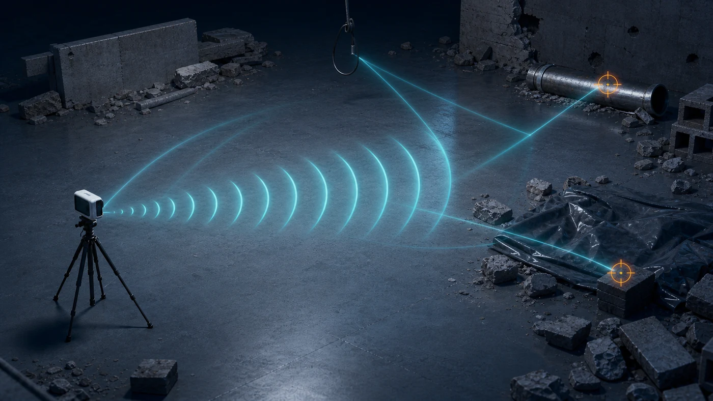
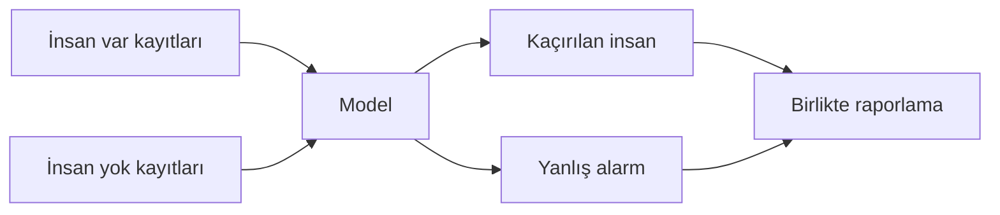

[← Önceki: Enkaz](enkaz-karmasik-yansima.md) · [Senaryolar](README.md)

# 4. Boş Ortam ve Yanlış Alarm Riski



*Temsili teknik illüstrasyon; turuncu işaretler insana ait olmayan belirsiz yansımaları temsil eder.*

## Sahne

Radarın görüş alanında insan yoktur. Buna rağmen metal, gevşek malzeme, titreşim veya çevredeki hareketler sinyalde değişim oluşturabilir.

## Neden buna ayrıca baktım?

Bir arama-kurtarma sisteminin iki farklı hatası vardır:

| Hata | Anlamı | Olası sonuç |
|---|---|---|
| **Yanlış negatif** | İnsan var, model “yok” diyor | Bir kişinin gözden kaçması |
| **Yanlış pozitif** | İnsan yok, model “var” diyor | Ekibin yanlış bölgeye yönelmesi |

İlk hata hayati risk taşır; ikinci hata ise zaman ve kaynak kaybına yol açabilir. Bu nedenle yalnızca genel doğruluk oranına bakmak yeterli değildir.

## Rescuer'daki karşılığı

```text
No human Presence / No Movement / Abs
No human Presence / No Movement / Angle
```

Yerel klasörde insan bulunmayan 24 CSV vardır. Dosya sayısı az görünse de bazı kayıtlar saatlerce sürdüğü için çok sayıda kısa pencere üretir.

## Modelin yanılabileceği yerler

- Aynı uzun kayıttan gelen çok benzer pencerelerin hem eğitime hem teste düşmesi
- Metal veya hareketli nesnelerin insan hareketi sanılması
- Sensör titreşiminin solunum örüntüsüne benzemesi
- Boş ortamların yalnızca tek laboratuvar koşulundan gelmesi

## Değerlendirirken ne yaptım?



- Uzun dosyaları rastgele bölmedim.
- Aynı kaynak dosyanın pencerelerini tek grupta tuttum.
- İnsan-yok sonuçlarını ayrıca gösterdim.
- Doğru ve yanlış kararları birlikte görmek için karışıklık matrisi kullandım.

> [!IMPORTANT]
> “İnsan yok” kayıtları gereksiz veri değildir; yanlış alarmı ölçmek için gerekir.

---

[← Enkaz senaryosu](enkaz-karmasik-yansima.md) · [Senaryo haritası](README.md) · [Ana sayfa](../../README.md)
