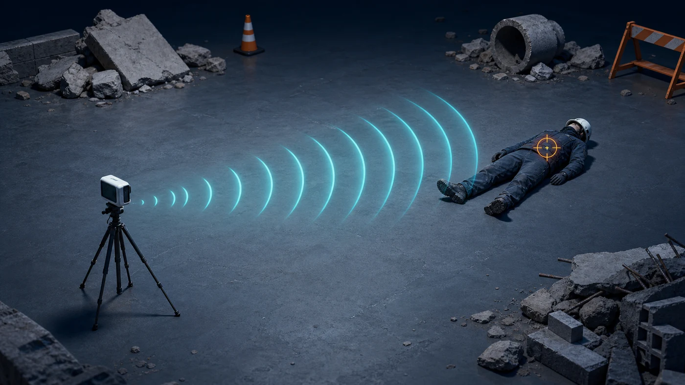
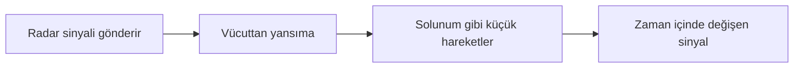

[← Senaryolar](README.md) · [Sonraki: Duvar arkası →](duvar-arkasi.md)

# 1. Doğrudan Görüş — Açık Ortam



*Temsili teknik illüstrasyon; saha fotoğrafı değildir.*

## Sahne

Radar ile kişi arasında duvar veya büyük bir engel yoktur. Bu, insan varlığı tespiti için en sade başlangıç koşuludur.

## Radar ne görür?



Radar doğrudan bir insan görüntüsü üretmez. Farklı mesafelerden dönen sinyalin zaman içinde nasıl değiştiğini ölçer. Göğüs hareketi küçük fakat düzenli bir değişim oluşturabilir.

## Rescuer'daki karşılığı

```text
Human Presence / Person ... / No Obstacle / ...
```

Bu kayıtlar:

- Farklı kişiler
- 0,5–5 m kişi-radar mesafesi
- Farklı radar yükseklikleri
- Farklı yatış yönelimleri
- Genlik (`abs`) ve faz (`angle`)

içerir.

## Modelin yanılabileceği yerler

| Risk | Basit açıklama |
|---|---|
| Kişinin radara uzak olması | Geri dönen sinyal zayıflayabilir |
| Kişinin yönelimi | Göğüs hareketinin radara görünen kısmı değişebilir |
| Büyük vücut hareketi | Küçük solunum örüntüsünü örtebilir |
| Zeminden yansıma | İnsan sinyaliyle karışan sabit yankılar oluşturabilir |

## Bu senaryoda başarı ne demek?

Modelin daha önce görmediği kişilerde ve farklı mesafelerde insan varlığını bulabilmesi gerekir. Yalnızca aynı kişinin benzer kayıtlarını ezberlemek başarı sayılmaz.

> [!NOTE]
> Bu senaryo temel durumdur. Açık ortamda çalışan bir modelin duvar veya enkaz arkasında da çalışacağı varsayılamaz.

---

[← Senaryo haritası](README.md) · [Duvar arkasındaki kişi →](duvar-arkasi.md)
