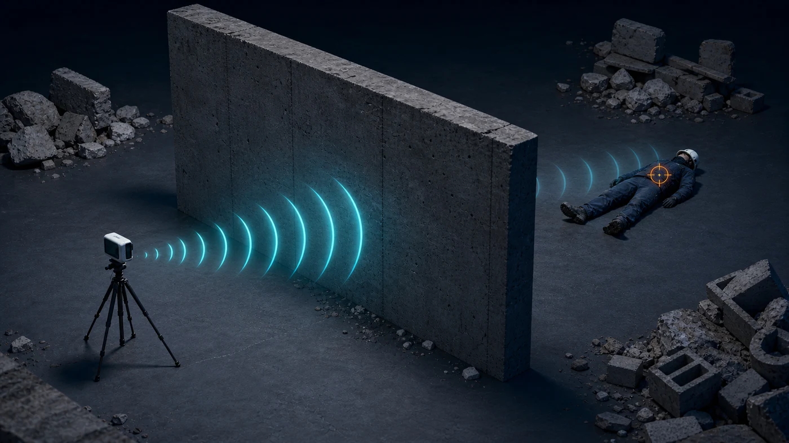
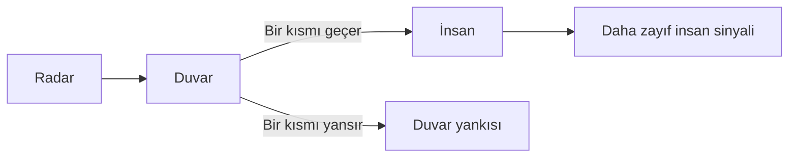

[← Önceki: Doğrudan görüş](dogrudan-gorus.md) · [Senaryolar](README.md)

# 2. Duvar Arkasındaki Kişi



*Temsili teknik illüstrasyon; saha fotoğrafı değildir.*

## Sahne

Radar ile kişi arasında görüşü kapatan bir duvar vardır. Rescuer veri setinin afet çalışması açısından en önemli kontrollü koşullarından biridir.

## Duvar sinyali nasıl etkiler?



Duvar, sinyalin bir bölümünü yansıtır ve bir bölümünü geçirir. Sonuçta model hem güçlü duvar yankısını hem de daha zayıf insan kaynaklı değişimi ayırmaya çalışır.

## Rescuer'daki karşılığı

```text
Human Presence / Person ... / Wall Obstacle / ...
```

Duvarlı kayıtları benzer mesafe ve yönelimdeki duvarsız kayıtlarla karşılaştırmak, duvar etkisini anlamayı kolaylaştırır.

> [!IMPORTANT]
> Klasör adı “duvar var” bilgisini verir; ancak her kayıtta duvar malzemesi ve ayrıntılı fiziksel özellikleri ayrı bir sütun olarak bulunmaz. Model sonuçları tüm duvar türlerine genellenemez.

## Modelin yanılabileceği yerler

| Risk | Basit açıklama |
|---|---|
| Duvar yankısının baskın olması | İnsan değişimi görünmez hale gelebilir |
| Çoklu yansıma | Aynı hedef farklı mesafelerdeymiş gibi görünebilir |
| Mesafe artışı | Duvar etkisiyle birlikte sinyal daha da zayıflar |
| Eğitim dengesizliği | Model “duvar var/yok” bilgisini insan etiketi sanabilir |

## Bu senaryoda başarı ne demek?

Duvarlı ve duvarsız kayıtların sonuçlarını ayrı inceledim. Özellikle duvarlı test grubundaki **kaçırılan insan sayısına** baktım.

Duvar arkasından insan tespiti, Rescuer çalışmasında doğrudan ele alınmıştır. Veri ve deney ayrıntıları [Rescuer Zenodo kaydında](https://doi.org/10.5281/zenodo.7679165) yer alıyor.

---

[← Doğrudan görüş](dogrudan-gorus.md) · [Enkaz ve karmaşık yansımalar →](enkaz-karmasik-yansima.md)
