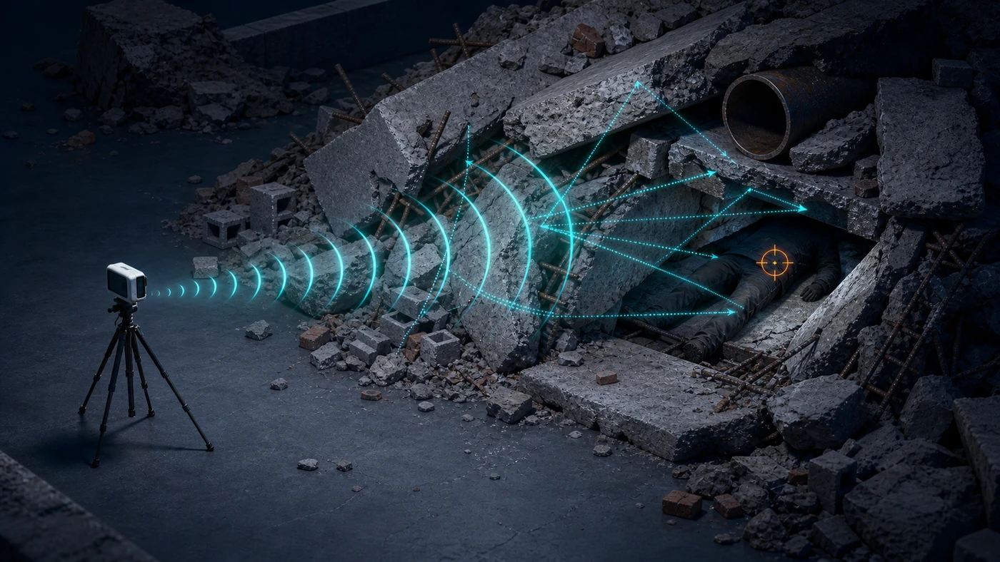
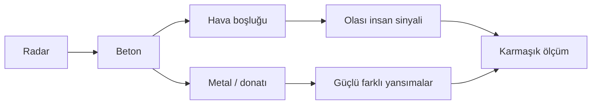

[← Önceki: Duvar arkası](duvar-arkasi.md) · [Senaryolar](README.md)

# 3. Enkaz ve Karmaşık Yansımalar

*Temsili teknik illüstrasyon; Rescuer veri setinden bir deney görüntüsü değildir.*

## Neden ayrı bir senaryo?

Tek bir duvar genellikle daha düzenli bir engeldir. Gerçek enkazda ise beton, tuğla, metal, borular ve hava boşlukları aynı anda bulunabilir.

## Radar neyle mücadele eder?

- Sinyalin birden fazla yoldan geri dönmesi
- Metal yüzeylerden güçlü yansıma
- Hava boşluklarında beklenmeyen yayılım
- Sahadaki makine ve insan hareketleri
- Sensörün veya zeminin titreşmesi

## Rescuer'daki karşılığı

**Doğrudan bir karşılığı yoktur.** Rescuer kontrollü duvarlı ve duvarsız koşullar sunar; gerçek, katmanlı enkaz geometrisi içermez.

Bu sayfayı modelin sınırını açıkça göstermek için ekledim:

> Duvar verisiyle eğitilen bir model, enkaz verisi görmeden “enkaz altında doğrulanmış” kabul edilemez.

## Böyle bir deneyi nasıl kurardım?

1. Güvenli ve kontrollü bir enkaz maketi hazırlardım.
2. Aynı düzende insan var ve insan yok kayıtları toplardım.
3. Beton, metal ve hava boşluğu bilgilerini kaydederdim.
4. Yeni kayıtları eğitim verisine karıştırmadan önce ayrı test ederdim.
5. Yanlış alarm ve kaçırılan insan sayılarına birlikte bakardım.

## Saha notu

Avrupa Komisyonu'nun [INACHUS proje özetinde](https://cordis.europa.eu/project/id/607522/reporting), radarın enkaz üzerine yerleştirilmesi, sensör altında mümkün olduğunca düz bir alan bulunması ve çevresel titreşimin düşük tutulması gerektiği vurgulanır. Bu, sensör yerleşiminin model kadar önemli olabileceğini gösterir.

Radar teknolojilerinin avantaj ve sınırlarına daha geniş bakış için [trapped-victim radar incelemesi](https://doi.org/10.1109/CAMA57522.2023.10352910) kullanılabilir.

---

[← Duvar arkası](duvar-arkasi.md) · [Boş ortam ve yanlış alarm →](bos-ortam-yanlis-alarm.md)
