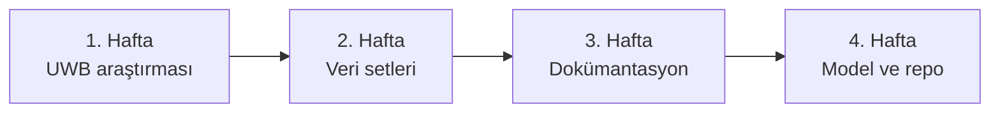

[← Ana sayfa](../../README.md)

# 4 Haftalık Staj Günlüğü

Bu sayfalarda staj boyunca paylaştığım günlük çalışma mesajlarını daha düzenli bir hale getirdim. Her gün için yaptığım çalışmayı ve gün sonunda hangi noktaya geldiğimi kısa şekilde anlattım.

| Hafta | Günler | Ana konu | Ayrıntı |
|---|---:|---|---|
| 1. Hafta | 1–5 | UWB araştırması ve raporlama | [Hafta sayfası](hafta-1.md) |
| 2. Hafta | 6–10 | Veri setleri ve makaleler | [Hafta sayfası](hafta-2.md) |
| 3. Hafta | 11–15 | Veri sözlüğü ve model araştırması | [Hafta sayfası](hafta-3.md) |
| 4. Hafta | 16–20 | Rescuer modeli ve GitHub reposu | [Hafta sayfası](hafta-4.md) |

## Genel ilerleme

Stajın ilk bölümünde UWB teknolojisini anlamaya ve topladığım bilgileri raporlamaya odaklandım. Ardından afet senaryolarıyla ilişkili veri setlerini ve bu veri setlerini tanıtan makaleleri inceledim. Son iki haftada veri sözlüğünü hazırlayıp Rescuer verisiyle örnek model çalışmalarına geçtim. Çalışmaları ve sonuçları bu GitHub reposunda bir araya getirdim.

---

[1. hafta →](hafta-1.md)
