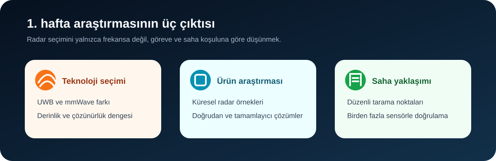

[← Ana sayfa](../../README.md)

# Teknoloji ve Ürünler

Stajın ilk haftasında hazırladığım **“UWB ve mmWave Radar Tabanlı Göçük Altı Yaşam Tespiti”** raporundaki notları burada üç kısa sayfaya ayırdım.

## Sayfalar

| Sayfa | İçerik |
|---|---|
| [**UWB ve mmWave karşılaştırması**](uwb-mmwave-karsilastirmasi.md) | İki radar yaklaşımının afet görevlerindeki güçlü ve zayıf yönleri |
| [**Arama-kurtarma radar ürünleri**](arama-kurtarma-urunleri.md) | Dünyadaki doğrudan ve tamamlayıcı ürün örnekleri |
| [**Saha taraması ve hibrit yaklaşım**](saha-taramasi-ve-hibrit-yaklasim.md) | Grid taraması, çevresel etkiler ve sensörlerin birlikte kullanımı |

## Rapordan çıkardığım sonuç

Göçük altında derin tarama ve yakın alanda ayrıntılı algılama aynı görev değildir:

- Düşük merkez frekanslı UWB/GPR sistemler enkaz içine ulaşmayı önceler.
- mmWave sistemler kısa mesafede ayrıntılı hareket ve konum bilgisi sunar.
- Gerçek sahada radar sonucunu sismik, akustik veya görüntüleme yöntemleriyle kontrol etmek gerekir.

## Türkiye için çıkarım

3 Temmuz 2026 tarihli raporu hazırlarken baktığım açık kaynaklarda, doğrudan göçük altı yaşam tespitine odaklanan yerli bir UWB/mmWave ürüne rastlamadım. Bu yalnızca ulaşabildiğim açık kaynaklar için geçerlidir.

> [!NOTE]
> Ürün sayfalarındaki mesafe ve algılama değerleri çoğunlukla üretici beyanıdır. Malzeme, nem, metal ve titreşim sonucu değiştirebilir.

---

[UWB ve mmWave karşılaştırması →](uwb-mmwave-karsilastirmasi.md)
