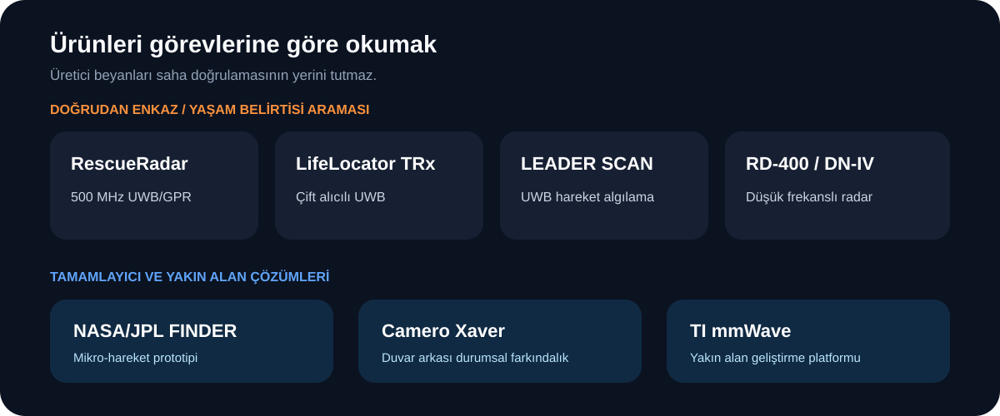

[← Teknoloji ve ürünler](README.md)

# Arama-Kurtarma Radar Ürünleri

İlk hafta raporunu hazırlarken ürünleri iki gruba ayırdım: doğrudan enkaz altında yaşam belirtisi arayanlar ve duvar arkası ya da yakın alan için kullanılanlar.

## Doğrudan enkaz arama ürünleri

| Ürün | Öne çıkan özellik | Neden inceledim? |
|---|---|---|
| [**RescueRadar**](https://www.sensoft.ca/products/rescue-radar/specification/) | 500 MHz UWB/GPR, malzemeye bağlı seçilebilir tarama derinliği | Ana referans ürün |
| [**LifeLocator TRx**](https://www.geophysical.com/support) | UWB radar ve çift alıcı yapısı | Gürültü ve tespit güveni karşılaştırması |
| [**LEADER SCAN / MULTISEARCH 4**](https://www.leader-group.company/en/urban-search-and-rescue-equipment-usar/usar-life-locator-detector-and-search-camera/usar-life-detectors-seismic-sensors/leader-multisearch-4-uwb-radar-3-seismic-sensors) | UWB radarın sismik sensörlerle birleştirilmesi | Hibrit ürün örneği |
| [**RD-400**](https://lifelocator.geotechru.com/) | 400 MHz taşınabilir yaşam dedektörü | Düşük frekanslı ürün örneği |
| [**Novasky DN-IV**](https://www.novasky.cn/en/Products/list.aspx?lcid=14) | Çoklu hedef konumlamaya odaklanan radar | Konumlandırma örneği |

## Tamamlayıcı çözümler

### NASA/JPL FINDER

FINDER, enkaz arkasındaki solunum ve kalp atışı kaynaklı küçük hareketleri algılayan düşük güçlü bir mikrodalga radar prototipidir. 2015 Nepal depremindeki kurtarma çalışmalarında kullanılmıştır.

[NASA/JPL FINDER saha hikâyesi](https://www.jpl.nasa.gov/news/finder-search-and-rescue-technology-helped-save-lives-in-nepal/)

### Camero Xaver

Xaver ailesi, derin göçük taramasından çok duvar arkası insan varlığı ve yaklaşık konum bilgisi için geliştirilmiştir. Hasarlı bina içindeki kapalı alanları anlamada tamamlayıcı rol üstlenebilir.

[Camero Xaver ürün ailesi](https://camero-tech.com/xaver-products/)

### TI mmWave geliştirme platformları

IWR6843AOP gibi kartlar doğrudan hazır bir kurtarma ürünü değildir. Yakın alanda hareket, konum ve yaşamsal işaret denemeleri geliştirmek için kullanılan sensör platformlarıdır.

[TI mmWave geliştirme ekosistemi](https://www.ti.com/design-development/embedded-development/mmwave-radar.html)

## Karşılaştırırken dikkat ettiğim noktalar

> [!CAUTION]
> Menzil ve algılama değerleri saha garantisi değildir. Üretici beyanları aynı standart deneyde ölçülmediği için doğrudan “en iyi ürün” sıralaması yapılamaz.

Yalnızca yazılan maksimum mesafeye bakmanın yeterli olmadığını gördüm. Şunlar da önemli:

- Hangi malzemeler arkasında denendi?
- Hareket mi, solunum mu algılanıyor?
- Yanlış alarm nasıl gösteriliyor?
- Ham veri dışa aktarılabiliyor mu?
- Tek sensör mü, hibrit sistem mi?
- Cihazın sahada taşınması ve kurulması kolay mı?

---

[← UWB ve mmWave](uwb-mmwave-karsilastirmasi.md) · [Sonraki: Saha yaklaşımı →](saha-taramasi-ve-hibrit-yaklasim.md)
