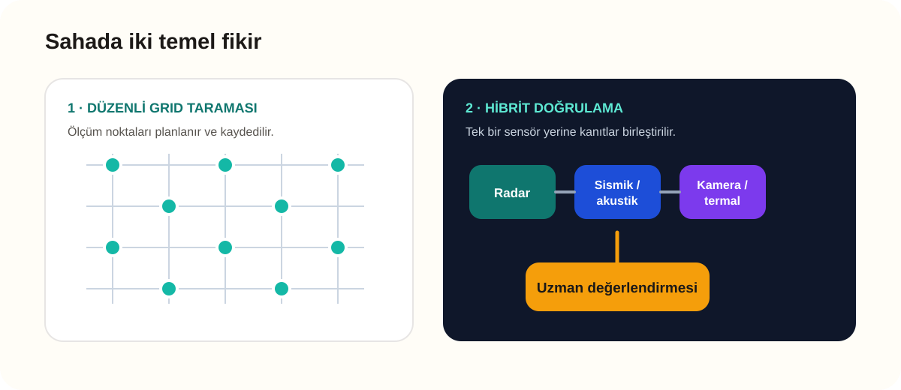

[← Teknoloji ve ürünler](README.md)

# Saha Taraması ve Hibrit Yaklaşım

Araştırma sırasında sensörün nereye yerleştirildiğinin de sonucu değiştirdiğini gördüm. Rastgele birkaç ölçüm almak yerine düzenli bir tarama yapmak daha mantıklıdır.

## Grid taraması nedir?

Enkaz yüzeyi küçük bölgelere ayrılır ve radar belirlenen noktalarda sırayla ölçüm alır. Böylece:

- Taranmayan alan bırakma riski azalır.
- Şüpheli sonuç farklı noktadan tekrar kontrol edilir.
- Ekip, hangi noktanın ne zaman tarandığını izleyebilir.
- Sonuçlar saha notlarıyla birlikte değerlendirilebilir.

Radarın kapsama alanı malzeme ve anten yapısına göre değişir. Bu nedenle grid aralığı sabit bir sayı olarak değil, cihaz kılavuzu ve saha koşuluna göre belirlenmelidir.

## Ölçümü bozabilecek durumlar

| Etken | Olası sonuç |
|---|---|
| Metal parçalar | Sinyali engelleyebilir veya güçlü yansıma oluşturabilir |
| Kurtarma ekibinin hareketi | İnsan varmış gibi değişim üretebilir |
| İş makinesi ve titreşim | Yanlış alarmı artırabilir |
| Su ve nem | Sinyalin malzeme içindeki davranışını değiştirebilir |
| Hatalı sensör yerleşimi | Bazı alanların tarama dışında kalmasına neden olabilir |

## Neden tek sensör yetmeyebilir?

Radar bir yaşam işareti verdiğinde sonucu başka bir yöntemle daha kontrol etmek gerekir:

1. UWB/GPR ile geniş alan taranır.
2. Şüpheli nokta farklı konumdan tekrar ölçülür.
3. Sismik veya akustik sensörle ses ve titreşim aranır.
4. Uygunsa kamera veya termal yöntem kullanılır.
5. Tüm bulgular uzman tarafından birlikte yorumlanır.

Bu sıra, radarın yanılabileceği durumlarda sonucu başka şekilde kontrol etmeyi sağlar.

> [!IMPORTANT]
> Radar sonucu, kazı veya arama önceliği için tek başına kesin karar olarak kullanılmamalıdır.

## Bu repoyla bağlantısı

- [Duvar arkası senaryosu](../senaryolar/duvar-arkasi.md)
- [Enkaz ve karmaşık yansıma senaryosu](../senaryolar/enkaz-karmasik-yansima.md)
- [Boş ortam ve yanlış alarm](../senaryolar/bos-ortam-yanlis-alarm.md)
- [Güvenli kullanım sınırları](../guvenli-kullanim/sinirlamalar.md)

## Kaynaklar

- [RescueRadar ürün ve kullanım kaynakları](https://www.sensoft.ca/products/rescue-radar/rescue-radar-resources/)
- [LEADER MULTISEARCH 4 hibrit sensör yaklaşımı](https://www.leader-group.company/en/urban-search-and-rescue-equipment-usar/usar-life-locator-detector-and-search-camera/usar-life-detectors-seismic-sensors/leader-multisearch-4-uwb-radar-3-seismic-sensors)
- [NASA/JPL FINDER saha uygulaması](https://www.jpl.nasa.gov/news/finder-search-and-rescue-technology-helped-save-lives-in-nepal/)

---

[← Radar ürünleri](arama-kurtarma-urunleri.md) · [Ana sayfa →](../../README.md)
