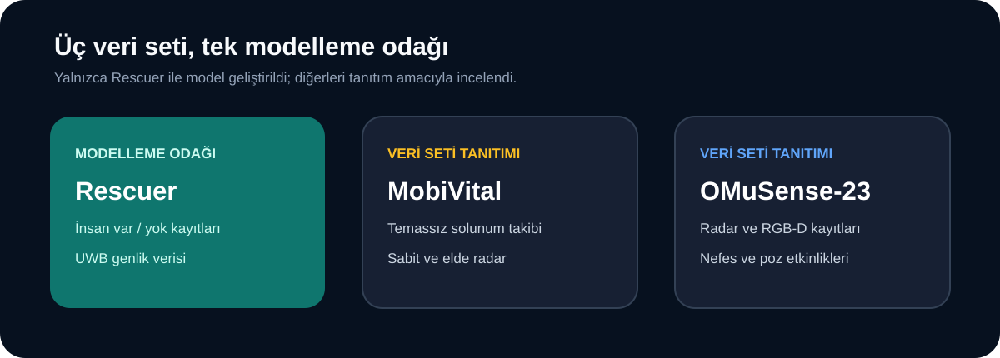

[← Ana sayfa](../../README.md)

# Veri Setleri

Repoda üç radar veri setini inceledim. Modeli yalnızca **Rescuer** ile kurdum; MobiVital ve OMuSense-23 içinse veri yapısı, yayın ve indirme bilgilerini ekledim.

## Hızlı karşılaştırma

| Veri seti | Temel konu | Bu repodaki kullanım |
|---|---|---|
| [**Rescuer**](rescuer.md) | UWB radar ile insan var/yok ölçümleri | İnceleme, görselleştirme ve model |
| [**MobiVital**](mobivital.md) | UWB radar ile temassız solunum takibi | Veri seti tanıtımı |
| [**OMuSense-23**](omusense-23.md) | Radar ve RGB-D ile nefes etkinlikleri | Veri seti tanıtımı |

## Veri sözlükleri

Veri sözlüğü, bir dosyanın adını, sütunlarını ve ölçümlerin ne anlama geldiğini açıklar.

- [Rescuer veri sözlüğü](rescuer.md)
- [MobiVital veri sözlüğü](mobivital.md)
- [OMuSense-23 veri sözlüğü](omusense-23.md)

## Makaleler ve veri edinimi

Her veri setinin deney düzeni, makalesi, resmî indirme adresi ve lisansı için ayrı bir sayfa hazırladım.

[Yayın ve veri edinimi sayfaları →](yayinlar-ve-edinim/README.md)

## Ham veriler neden repoda değil?

- Veri dosyaları GitHub için çok büyüktür.
- Her veri setinin lisans ve atıf koşulu farklıdır.
- Verilerin resmî kaynaktan ve doğru sürümle indirilmesi gerekir.

Bu yüzden repoda ham kayıtlar yerine açıklamalar, analiz kodları ve küçük sonuç dosyaları bulunuyor.

---

[← Ana sayfa](../../README.md) · [Rescuer →](rescuer.md)
