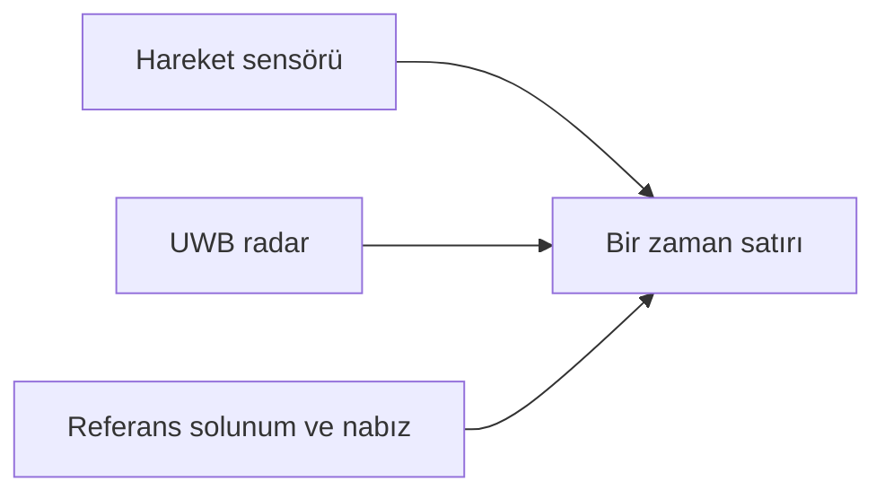

[← Veri setleri](README.md) · [Yayın ve edinim](yayinlar-ve-edinim/mobivital.md)

# MobiVital Veri Sözlüğü

MobiVital, UWB radar ile temassız solunum takibini araştıran bir veri setidir. Radar sabit tripod üzerinde ve elde taşınarak kullanılmış; sonuçlar referans sensörlerle birlikte kaydedilmiştir.

> [!NOTE]
> Bu veri setiyle model geliştirmedim. Yalnızca yapısını ve ilgili yayını tanıttım.

## Bir dosya nasıl okunur?

Her CSV satırı aynı zamana ait hareket sensörü, radar ve referans ölçümlerini yan yana tutar. Dosyalarda başlık bulunmadığı için sütun sırası önemlidir.



## Dosya adı

Örnek:

```text
231024_userF_handheld_01_0.csv
```

| Parça | Anlamı |
|---|---|
| `231024` | Kayıt tarihi |
| `userF` | Anonim katılımcı kodu |
| `handheld` | Radarın elde taşındığı koşul |
| `01` | Oturum numarası |
| `0` | Oturum içindeki parça |

## 254 sütunun özeti

| Sütun | İçerik |
|---:|---|
| 1–6 | İvmeölçer ve jiroskop |
| 7–12 | Kullanılmayan eski alanlar |
| 13–132 | UWB sinyalinin `I` bölümü |
| 133–252 | UWB sinyalinin `Q` bölümü |
| 253 | Referans solunum dalgası |
| 254 | Referans nabız dalgası |

`I` ve `Q`, aynı radar dönüşünün iki bileşenidir. Birlikte kullanıldıklarında sinyalin büyüklüğü ve fazı hesaplanabilir.

## Veri kontrolleri

- Her dosyada 254 sütun bulunmalıdır.
- Çok kısa veya bozuk kayıtlar analiz dışında tutulmalıdır.
- Kullanılmayan 7–12. sütunlar analize eklenmemelidir.
- `I` ve `Q` menzil noktaları doğru sırayla eşleştirilmelidir.
- Referans sensörlerde boş veya sabit değer bulunup bulunmadığı kontrol edilmelidir.

> [!CAUTION]
> Solunum ve nabız alanları araştırma verisidir; tıbbi teşhis amacıyla kullanılamaz.

## Kaynak

Sütun tanımları [MobiVital resmî veri deposundan](https://github.com/nesl/MobiVital-dataset) alınmıştır. Yayın, veri toplama yöntemi ve indirme bağlantıları [MobiVital yayın sayfasında](yayinlar-ve-edinim/mobivital.md) açıklanır.

---

[← Rescuer](rescuer.md) · [OMuSense-23 →](omusense-23.md)
