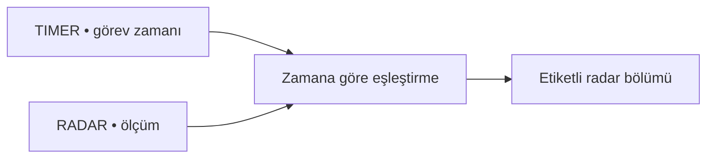

[← Veri setleri](README.md) · [Yayın ve edinim](yayinlar-ve-edinim/omusense-23.md)

# OMuSense-23 Veri Sözlüğü

OMuSense-23; radar, RGB-D kamera ve farklı nefes etkinliklerini aynı çalışma içinde buluşturan çok modlu bir veri setidir.

> [!NOTE]
> Bu veri setiyle model geliştirmedim. Yalnızca yapısını ve ilgili yayını tanıttım.

## Klasör yapısı

Her katılımcı üç farklı pozda kaydedilmiştir:

| Kod | Poz |
|:---:|---|
| `A` | Ayakta |
| `B` | Oturarak |
| `C` | Yatarak |

Örnek dosya:

```text
Data/001/001_A_2023.06.09__10.27.32_RADAR.csv
```

Bu ad; katılımcı kodunu, pozu, kayıt zamanını ve sensör türünü birlikte gösterir.

## Katılımcı başına dosyalar

| Dosya türü | İçerik |
|---|---|
| `RADAR.csv` | Radarın hareket ve yaşamsal sinyal çıktıları |
| `RGB.csv` | Kamera karelerinin zaman bilgisi |
| `DEPTH.csv` | Derinlik kamerasından çıkarılan sinyal |
| `rppg_chrom.csv` | Yüz bölgesinden çıkarılan rPPG sinyali |
| `TIMER.csv` | Nefes görevlerinin başlangıç ve bitiş zamanları |

Radar ve görev dosyaları zaman bilgisiyle eşleştirilir.



## Radar dosyasındaki temel alanlar

Radar CSV'sinde 46 sütun bulunur. Başlangıç için şu alanları tanımak yeterlidir:

| Alan | Sade anlamı |
|---|---|
| `time_stamp` | Ölçüm zamanı |
| `frameNumber` | Radar karesi |
| `rangeBinIndexMax` | Güçlü yansımanın bulunduğu menzil noktası |
| `unwrapPhasePeak_mm` | Küçük göğüs hareketlerini temsil eden sinyal |
| `outputFilterBreathOut` | Filtrelenmiş solunum dalgası |
| `outputFilterHeartOut` | Filtrelenmiş kalp dalgası |
| `motionDetectedFlag` | Hareket algılama göstergesi |

Diğer sütunların çoğu cihaz ayarı, güven değeri ve paket bilgisi içerir.

## Etkinlikler

Katılımcılar her pozda dört ana görev yapmıştır:

- Normal nefes alma
- Sesli okuma
- Yönlendirilmiş nefes
- Nefes tutma

Geçiş ve dinlenme bölümleri ayrıca işaretlenmiştir.

## Veri özeti

| Başlık | Değer |
|---|---:|
| Katılımcı | 50 |
| Poz | 3 |
| Radar dosyası | 150 |
| Toplam CSV | 751 |

Veri paketinde yaş, boy, kilo ve ülke gibi biyometrik alanlar da bulunur. Bunlar hassas bilgi sayılmalı ve yalnızca gerçekten gerekli olduğunda kullanılmalıdır.

## Kaynak

Dosya tanımlarını veri paketiyle gelen açıklamalardan aldım. Deney bilgilerini [OMuSense-23 makalesi](https://arxiv.org/abs/2407.06137) ve [Zenodo v3 kaydı](https://doi.org/10.5281/zenodo.12705176) üzerinden kontrol ettim.

---

[← MobiVital](mobivital.md) · [Veri setleri ana sayfası →](README.md)
