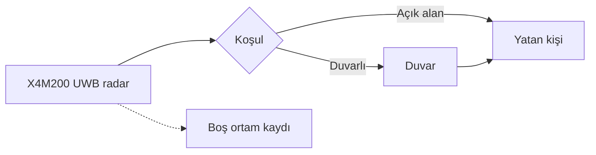
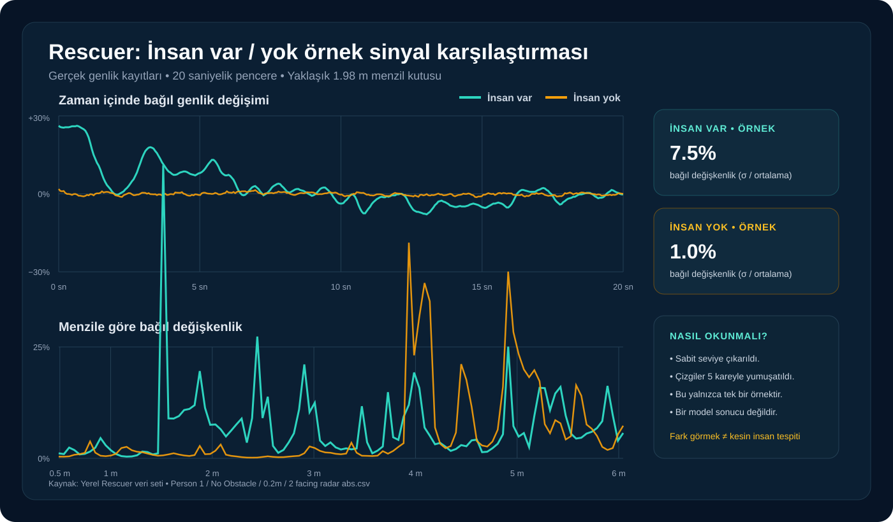
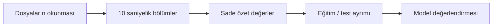

[← Veri setleri](README.md) · [Yayın ve veri edinimi](yayinlar-ve-edinim/rescuer.md)

# Rescuer Veri Seti

## Kısaca nedir?

Rescuer, bir UWB radarın farklı mesafe, duruş ve engel koşullarında insan varlığını nasıl ölçtüğünü araştırmak için hazırlanmıştır.

| Başlık | Bilgi |
|---|---|
| Sensör | Novelda X4M200 UWB radar |
| Katılımcı | 9 kişi |
| Koşullar | Duvarlı ve duvarsız |
| Mesafe | 0,5–5 metre |
| Kayıt biçimi | Genlik ve faz CSV dosyaları |
| Örnekleme | Yaklaşık saniyede 17 radar karesi |

[Resmî veri seti — Zenodo](https://doi.org/10.5281/zenodo.7679165)

## Deney düzeni



Bu düzen sayesinde insan varlığının yanında mesafe ve duvar etkisi de incelenebilir.

## Klasör yolu ne anlatır?

Örnek:

```text
Human Presence / Person 6 / Wall Obstacle / 0.5m /
3 facing up abs.csv
```

| Yol parçası | Anlamı |
|---|---|
| `Human Presence` | Ortamda insan var |
| `Person 6` | Altıncı katılımcı |
| `Wall Obstacle` | Radar ile kişi arasında duvar var |
| `0.5m` | Radarın yerden yüksekliği |
| `3` | Kişi radardan 3 metre uzakta |
| `facing up` | Kişinin yönü |
| `abs` | Genlik verisi |

Klasör ve dosya adları model için gerekli etiketlerin büyük bölümünü taşır.

## CSV dosyasının içi

| Bölüm | İçerik |
|---|---|
| İlk satır | Yaklaşık 0,49–6,04 metre arasındaki 109 menzil noktası |
| Sonraki satırlar | Her anda ölçülen 109 radar değeri |
| `abs` dosyası | Sinyalin genliği |
| `angle` dosyası | Sinyalin fazı |

> [!CAUTION]
> İlk satır bir radar ölçümü değil, uzaklık eksenidir. Modele veri satırı olarak verilmemelidir.

## Gerçek veriden örnek



Grafikte insan bulunan ve bulunmayan iki kısa kayıt karşılaştırılır. İnsan bulunan örnekte değişim daha güçlü görünür; ancak tek bir grafik genel bir tespit kuralı değildir.

## Yerel veri özeti

| Başlık | Değer |
|---|---:|
| Toplam CSV | 743 |
| İnsan bulunan CSV | 719 |
| İnsan bulunmayan CSV | 24 |
| Katılımcı | 9 |
| Yerel klasör boyutu | Yaklaşık 2,55 GB |

İnsan-yok dosyalarının sayısı az olsa da bazıları çok daha uzundur. Bu yüzden yalnızca dosya sayısına bakmak yanıltıcı olabilir.

## Model için nasıl hazırlandı?



İlk modelde yalnızca genlik verisini kullandım. Test kişilerini eğitimin dışında tuttum ve uzun dosyaların modeli fazla etkilememesi için pencere sayılarını sınırladım.

[Model geliştirme günlüğü →](../model/README.md)

## Lisans

Veri seti [CC BY-NC-SA 4.0](https://creativecommons.org/licenses/by-nc-sa/4.0/) ile yayımlanmıştır. Kaynak belirtilmeli, ticari kullanım koşulları kontrol edilmeli ve uyarlamalar aynı lisans koşullarını korumalıdır.

Ham verileri bu GitHub reposuna eklemedim.

> [!NOTE]
> Bu projede 2023 tarihli Rescuer verisini kullandım. 2024 devam çalışması farklı deney koşulları içerdiği için iki veri setini karıştırmamak gerekir.

---

[← Veri setleri](README.md) · [Model günlüğü →](../model/README.md)
