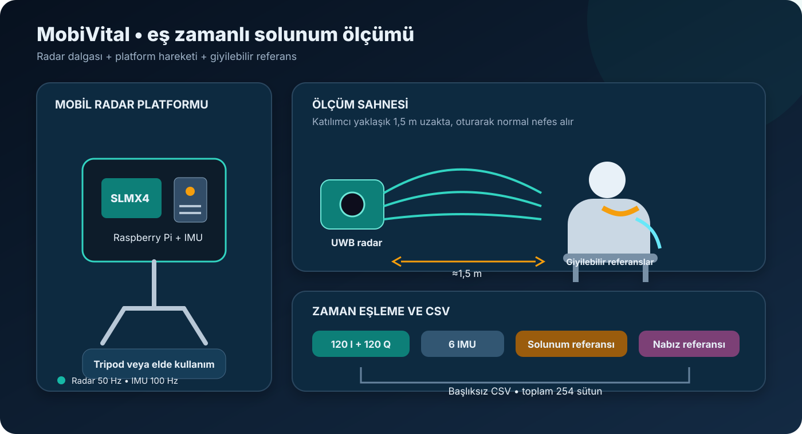

[← Yayınlar ve veri edinimi](README.md) · [Veri sözlüğü](../mobivital.md)

# MobiVital: Yayın ve Veri Toplama

MobiVital, hareketli bir UWB radarın solunum dalgasını ne kadar güvenilir ölçebildiğini araştırır.

Makaledeki veri toplama yöntemi sadeleştirilerek yeniden çizilmiştir.

## İlgili yayın

**Wang ve diğerleri, 2025 — _MobiVital: Self-supervised Time-series Quality Estimation for Contactless Respiration Monitoring Using UWB Radar_**

- [Makale / arXiv](https://arxiv.org/abs/2503.11064)
- [ACM yayın kaydı](https://doi.org/10.1145/3722570.3726878)
- [Resmî kod deposu](https://github.com/nesl/mobivital-public)

Makale yalnızca nefes hızını bulmaya değil, radar sinyalinin bozulduğu bölümleri fark etmeye de odaklanır.

## Veri nasıl elde edildi?

1. On iki katılımcı normal şekilde nefes aldı.
2. UWB radar yaklaşık 1,5 metre uzağa yerleştirildi.
3. Radar hem tripod üzerinde hem elde taşınarak kullanıldı.
4. Hareket sensörü radarın hareketini kaydetti.
5. Solunum kemeri ve parmak sensörü referans sağladı.
6. Tüm ölçümler zaman bakımından eşleştirildi.

## Veri paketinde ne var?

| Başlık | Bilgi |
|---|---|
| Katılımcı | 12 |
| Dosya türü | Başlıksız CSV |
| Radar gösterimi | 120 `I` + 120 `Q` menzil noktası |
| Ek sensörler | İvmeölçer, jiroskop, solunum ve nabız referansı |
| Koşullar | Tripod ve elde kullanım |

## İndirme ve lisans

- [Zenodo veri kaydı](https://doi.org/10.5281/zenodo.15022885)
- [Resmî veri GitHub'ı](https://github.com/nesl/MobiVital-dataset)
- Lisans: [CC BY 4.0](https://creativecommons.org/licenses/by/4.0/)

Bu projede MobiVital ile model geliştirmedim; veri setini ve yayınını yalnızca tanıttım.

> [!CAUTION]
> Solunum ve nabız alanları araştırma amaçlıdır; tıbbi teşhis olarak yorumlanmamalıdır.

---

[← Rescuer](rescuer.md) · [OMuSense-23 →](omusense-23.md)
