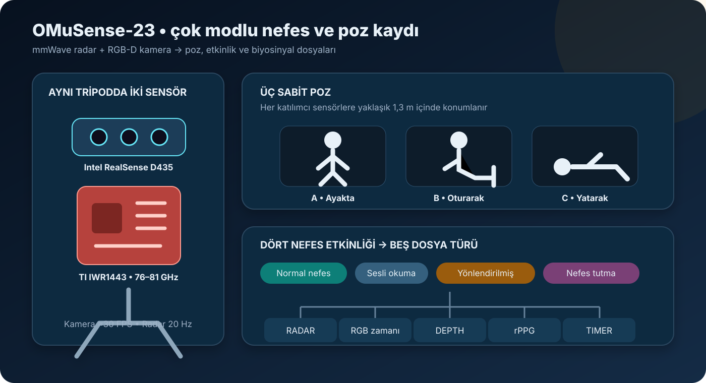

[← Yayınlar ve veri edinimi](README.md) · [Veri sözlüğü](../omusense-23.md)

# OMuSense-23: Yayın ve Veri Toplama

OMuSense-23, farklı poz ve nefes görevlerini radar ile RGB-D kamera kullanarak birlikte kaydeden bir veri setidir.

Makaledeki sensör, poz ve etkinlik açıklamaları sadeleştirilerek yeniden çizilmiştir.

## İlgili yayın

**Lage Cañellas ve diğerleri, 2024 — _OMuSense-23: A Multimodal Dataset for Contactless Breathing Pattern Recognition and Biometric Analysis_**

- [Makale / arXiv](https://arxiv.org/abs/2407.06137)
- [Güncel Zenodo v3 kaydı](https://doi.org/10.5281/zenodo.12705176)

Makale; nefes etkinliklerini, beden pozlarını ve farklı sensörlerin birlikte kullanımını inceler.

## Veri nasıl elde edildi?

1. Elli katılımcı çalışmaya katıldı.
2. mmWave radar ve RGB-D kamera aynı düzeneğe yerleştirildi.
3. Her katılımcı ayakta, oturarak ve yatarak kaydedildi.
4. Normal nefes, okuma, yönlendirilmiş nefes ve nefes tutma görevleri yapıldı.
5. Radar ve kamera kayıtları zaman bilgisiyle eşleştirildi.

## Kullanılan sensörler

| Sensör | Görevi |
|---|---|
| TI IWR1443 mmWave radar | Göğüs hareketi ve solunum sinyali |
| Intel RealSense D435 | RGB ve derinlik bilgisi |

## Veri paketinde ne var?

| Başlık | Bilgi |
|---|---:|
| Katılımcı | 50 |
| Poz | 3 |
| Radar CSV | 150 |
| Toplam CSV | 751 |

Radar, kamera zamanı, derinlik, rPPG ve görev zamanlayıcısı ayrı dosyalarda tutulur.

## İndirme ve lisans

- [Zenodo v3 veri kaydı](https://doi.org/10.5281/zenodo.12705176)
- Lisans: [CC BY 4.0](https://creativecommons.org/licenses/by/4.0/)

Bu projede OMuSense-23 ile model geliştirmedim; veri setini ve yayınını yalnızca tanıttım.

> [!CAUTION]
> Pakette yaş, kilo ve ülke gibi kişisel sayılabilecek alanlar bulunur. Bu alanlar yalnızca gerektiğinde kullanılmalıdır.

---

[← MobiVital](mobivital.md) · [Veri setleri →](../README.md)
