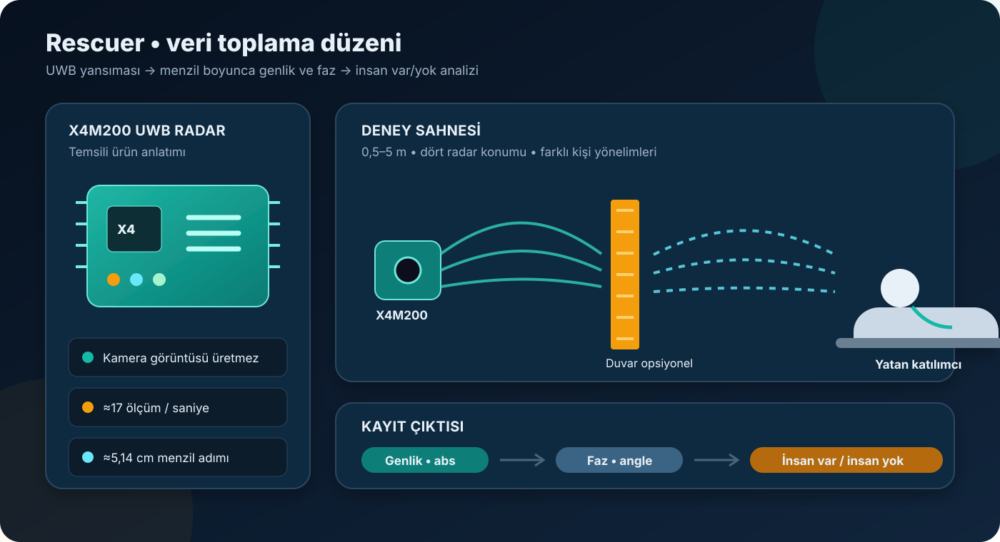

[← Yayınlar ve veri edinimi](README.md) · [Rescuer veri sözlüğü](../rescuer.md)

# Rescuer: Yayın, Veri Toplama ve X4M200

## Kısa cevap

Rescuer, **duvar arkasında yatan bir kişinin UWB radar ile fark edilip edilemeyeceğini** araştırır. İlk insan var/yok modelimi bu veriyle kurdum.

Özgün şema — X4M200 bölümü temsili bir ürün anlatımıdır, ölçekli ürün fotoğrafı değildir.

## İlgili yayınlar

### Veri setini tanıtan çalışma

**Uzunidis ve diğerleri, 2023 — _A Dataset for Aftermath Victim Detection Behind Walls or Obstacles Using an UWB Radar Sensor_**

- [Yayın DOI’si](https://doi.org/10.1109/MOCAST57943.2023.10176448)
- [Resmî Zenodo veri kaydı](https://doi.org/10.5281/zenodo.7679165)
- Çalışma; yaklaşık 15 saatlik kayıt, farklı engel ve kişi yönelimleri ile basit bir insan tespit yaklaşımını açıklar.

### Karıştırılmaması gereken devam çalışması

2024 tarihli çalışma; farklı duvar kalınlıkları, ayakta/yatarak ölçümler ve solunum kemeri referansı içeren **ayrı bir veri sürümünü** ele alır.

- [2024 veri kaydı](https://doi.org/10.5281/zenodo.10779256)
- [2024 ön baskı](https://doi.org/10.20944/preprints202403.0271.v1)

> [!IMPORTANT]
> Bu repodaki modeller yalnızca yerel **2023 Rescuer** verisiyle kurulmuştur. İki sürüm birleştirilmemiştir.

## Veri nasıl elde edildi?

1. Dokuz katılımcı yaklaşık bir dakika boyunca yatar durumda kaydedildi.
2. Radar ile kişi arasında bazı oturumlarda duvar bulunurken bazılarında doğrudan görüş vardı.
3. Kişi radardan 0,5–5 m uzağa yerleştirildi.
4. Radar 0,2 m, 0,5 m, 1 m/0° ve 1 m/45° konumlarında kullanıldı.
5. Kişinin radara göre farklı yönelimleri denendi.
6. Her koşul için sinyalin genliği (`abs`) ve fazı (`angle`) kaydedildi.
7. Karşılaştırma için insan bulunmayan ortam ölçümleri de alındı.

Radar yaklaşık saniyede 17 kayıt üretir. Komşu menzil noktaları arasındaki uzaklık yaklaşık 5,14 cm’dir.

## X4M200 nedir?

X4M200, Novelda’nın X4 UWB radar teknolojisini kullanan temassız solunum algılama modülüdür. Kamera gibi görüntü üretmez; gönderdiği kısa radyo darbelerinin yansımalarını ölçer.

Benim için öne çıkan üç özellik:

- Yaklaşık 5 cm’lik menzil adımlarıyla yansımaları ayırabilmesi
- Çok küçük göğüs hareketlerinin sinyalde değişim oluşturabilmesi
- Metal dışındaki bazı engellerin arkasından ölçüm yapılabilmesine imkân vermesi

Üreticinin güncel X4 teknoloji özeti: [NOVELDA X4 veri sayfası](https://novelda.com/technology/datasheets)

## Yerel arşivde ne var?

| Yerel bulgu | Değer |
|---|---:|
| Toplam CSV | 743 |
| İnsan bulunan kayıt | 719 |
| İnsan bulunmayan kayıt | 24 |
| Genlik dosyası | 373 |
| Faz dosyası | 370 |
| Katılımcı kimliği | 1–9 |
| Açılmış klasör boyutu | ≈2,55 GB |

Her dosyanın ilk satırı 109 menzil noktasını, sonraki satırlar radar ölçümlerini içerir. Ayrıntılı sütun ve dosya adı açıklaması için [Rescuer veri sözlüğüne](../rescuer.md) bakılabilir.

## İndirme, sürüm ve lisans

- Resmî sürüm: **1.0**, 26 Şubat 2023
- Resmî arşiv: Yaklaşık **909,8 MB**
- DOI: [10.5281/zenodo.7679165](https://doi.org/10.5281/zenodo.7679165)
- Lisans: [CC BY-NC-SA 4.0](https://creativecommons.org/licenses/by-nc-sa/4.0/)

Bu lisans; atıf verilmesini, ticari olmayan kullanımı ve uyarlamaların aynı lisansla paylaşılmasını gerektirir.

## Ben nasıl kullandım?

Rescuer verisiyle:

- İnsan var/yok sınıflandırması yaptım.
- Logistic Regression ve Random Forest modellerini karşılaştırdım.
- Hataları ve karar eşiğini inceledim.
- Sonucu gerçek saha sistemi olarak değil, bir başlangıç çalışması olarak değerlendirdim.

---

[← Kategori](README.md) · [MobiVital →](mobivital.md)
